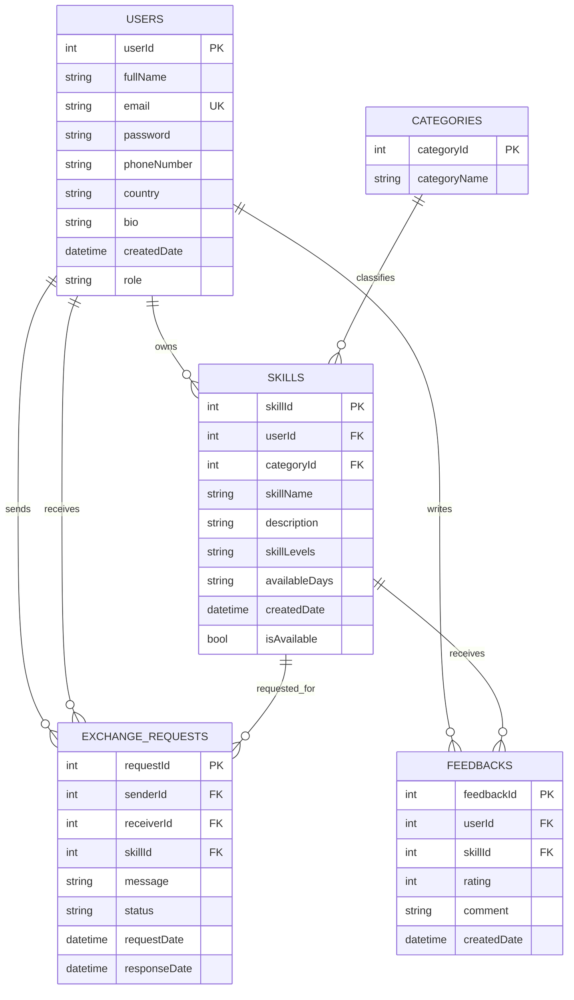

# Skill Exchange ERD

```mermaid
erDiagram
    USERS ||--o{ SKILLS : owns
    CATEGORIES ||--o{ SKILLS : classifies
    USERS ||--o{ EXCHANGE_REQUESTS : sends
    USERS ||--o{ EXCHANGE_REQUESTS : receives
    SKILLS ||--o{ EXCHANGE_REQUESTS : requested_for
    USERS ||--o{ FEEDBACKS : writes
    SKILLS ||--o{ FEEDBACKS : receives

    USERS {
        int userId PK
        string fullName
        string email UK
        string password
        string phoneNumber
        string country
        string bio
        datetime createdDate
        string role
    }
    CATEGORIES {
        int categoryId PK
        string categoryName
    }
    SKILLS {
        int skillId PK
        int userId FK
        int categoryId FK
        string skillName
        string description
        string skillLevels
        string availableDays
        datetime createdDate
        bool isAvailable
    }
    EXCHANGE_REQUESTS {
        int requestId PK
        int senderId FK
        int receiverId FK
        int skillId FK
        string message
        string status
        datetime requestDate
        datetime responseDate
    }
    FEEDBACKS {
        int feedbackId PK
        int userId FK
        int skillId FK
        int rating
        string comment
        datetime createdDate
    }
```
